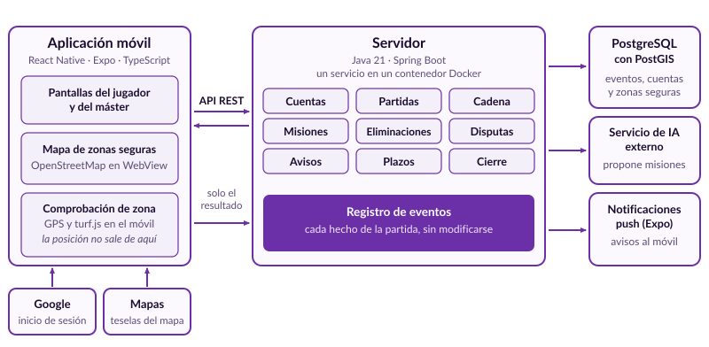

# Arquitectura

Documentación viva del diseño. Se actualiza en la misma *pull request* que cambia el diseño (definición de hecho). Diagramas nuevos en Mermaid dentro de este fichero o en ficheros hermanos.

## Planteamiento inicial (fase previa)

Todas las reglas del juego se ejecutan en un único servidor, dividido en módulos y desplegado en un contenedor Docker. Hay un solo despliegue y una sola base de datos, así que no hay llamadas de red entre servicios. El móvil muestra el estado y envía las acciones del jugador, y es el servidor quien decide si son válidas. Lo que depende del tiempo, como el arranque de la partida o el fin del plazo para disputar, lo lanza un planificador del propio servidor.

Cada partida se guarda como una lista de eventos: una eliminación, una disputa, un abandono o un reparto de objetivos es un evento que después no se modifica, y el estado actual se obtiene reproduciéndolos. Anular una eliminación consiste en dejar de contar ese evento y añadir el del nuevo reparto, y todas las anulaciones quedan a la vista de los jugadores. Los eventos solo se modifican para quitar los datos de quien borra su cuenta. Al cerrar la partida se borran todos y se conserva únicamente el resumen agregado.

La posición del jugador nunca sale del móvil. Cuando se introduce un código de vida, el móvil comprueba con el GPS si el jugador está dentro de una zona segura y envía solo el resultado (dentro, fuera o no concluyente). El servidor no recibe ni guarda ninguna posición.

## Cambios por sprint

<!-- S1: módulos creados, modelo de datos, decisiones (PaaS, proveedor de IA, biblioteca del mapa)… Lo de cada sprint va a N.2 de la memoria. -->

## Decisiones técnicas abiertas

| Decisión | Cuándo se toma | Opciones | Decidido |
|--|--|--|--|
| PaaS del despliegue | Sprint 1 | Render, Railway, Fly.io (PostGIS, coste, continuidad) | |
| Proveedor de IA | Sprint 1 | Según coste y condiciones de uso | |
| Biblioteca del mapa | Primera PBI con mapa | OpenLayers, Leaflet | |
| Migración a la nube | Ensayo en el sprint 3 | Azure, AWS | |
