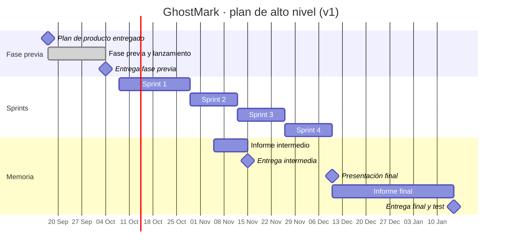

# Calendario y diagrama de Gantt

Grupo B, sesiones de prácticas en jueves alternos. Cada sprint empieza con su planificación y acaba con la revisión y la retrospectiva en la sesión siguiente.

| Sesión | Fecha | Qué se hace |
|--|--|--|
| P1 | 2026-09-24 | Fase previa y lanzamiento |
| — | 2026-10-04 | Entrega del informe de la fase previa |
| P2 | 2026-10-08 | Planificación del sprint 1 (2 h) |
| P3 | 2026-10-29 | Revisión y retrospectiva del S1 · planificación del S2 |
| P4 | 2026-11-12 | Revisión y retrospectiva del S2 · planificación del S3 |
| — | 2026-11-15 | Entrega intermedia: sprints 1 y 2 y planificación del 3 (máx. 7.500 palabras) |
| P5 | 2026-11-26 | Revisión y retrospectiva del S3 · planificación del S4 |
| — | 2026-12-10 | Revisión del S4 = presentación final en clase (fecha por confirmar) |
| — | 2027-01-15 | Informe final (máx. 10.000 palabras) y test |

## Gantt de alto nivel · versión 1 (planificada, 2026-09-27)

Cada sprint es una tarea; se incluyen las actividades que no caen dentro de un sprint y los hitos. **Al final del proyecto se añade la versión 2 con las fechas reales** y se analizan las diferencias; las dos versiones van al capítulo 6 de la memoria.

## Gantt · versión 2 (real)

<!-- Se rellena al final del proyecto con las fechas reales. Tabla de desvíos: fecha planificada, real, desvío en días y motivo. -->
