<!-- Instantánea congelada: no se edita. -->
> **Instantánea 00 · Pila del producto inicial** tal como se entregó en el informe de la fase previa (entrega del 4 de octubre de 2026). Copia literal del apartado 5. Es la pila de partida del capítulo 2.1 de la memoria salvo que se refine antes de planificar el sprint 1 (entonces manda `S1-antes-de-planificar.md`).

# 5. Pila del producto inicial

Estas son las funcionalidades de GhostMark, de más a menos prioritaria. Las 18 primeras forman la primera versión, y las 10 últimas, las dos siguientes: Ghostmark Social (L2) y Ghostmark Organizations (L3). La talla es relativa: cualquier S cuesta menos que cualquier M, y así hasta XL. Las de L2 y L3 llevan XXL porque son mayores que cualquier XL y todavía no se han desglosado. Las de la primera versión llevan criterios de satisfacción, con la forma «estará cumplido cuando se pueda hacer X y se verifique que Z». Las cinco primeras tienen además una ficha con aclaraciones y pantallas del prototipo, y el resto se resume en la tabla final. Los requisitos no funcionales están en la definición de hecho, no en la pila.

## Prioridad y tallas

| N.º | Funcionalidad | Talla | Detalle |
|--|--------------------------------|--|-----------|
| 1 | Cuenta del jugador (crear cuenta e inicio de sesión) | M | Detallado, sprint 1 |
| 2 | Crear y configurar una partida | M | Detallado, sprint 1 |
| 3 | Inscribirse en una partida | M | Detallado, sprint 1 |
| 4 | Arrancar la partida y formar la cadena de objetivos | M | Detallado, sprint 1 |
| 5 | Ver mi objetivo y mi misión | S | Detallado, sprint 1 |
| 6 | Misiones: biblioteca, IA y aprobación del máster | L | Tabla final |
| 7 | Código de vida y eliminación | XL | Tabla final |
| 8 | Cierre de partida, ganador y empate | M | Tabla final |
| 9 | Horarios seguros | M | Tabla final |
| 10 | Zonas seguras | L | Tabla final |
| 11 | Disputas y anulación | XL | Tabla final |
| 12 | Abandonar, expulsar y reportar | M | Tabla final |
| 13 | Avisos al móvil | M | Tabla final |
| 14 | Ghostmark Wrapped y borrado de datos al cerrar | M | Tabla final |
| 15 | Amigos e invitaciones directas | M | Tabla final |
| 16 | Entradas tardías | S | Tabla final |
| 17 | Importar el horario lectivo desde el calendario | S | Tabla final |
| 18 | Acceso con Google | S | Tabla final |
| 19 | Modo por equipos | XXL | L2 |
| 20 | Purga final | XXL | L2 |
| 21 | Partida relámpago | XXL | L2 |
| 22 | Co-másters | XXL | L2 |
| 23 | Perfiles de organización | XXL | L3 |
| 24 | Plantillas de partida | XXL | L3 |
| 25 | Panel de estadísticas | XXL | L3 |
| 26 | Eventos de varias partidas | XXL | L3 |
| 27 | Validación reforzada | XXL | L3 |
| 28 | Premios | XXL | L3 |

## Fichas de las cinco funcionalidades más prioritarias

### 1. Cuenta del jugador (crear cuenta e inicio de sesión) · talla M · sprint 1

Se crea una sola vez y sirve para todas las partidas. La cuenta guarda solo el alias, los datos de acceso (email y contraseña), el horario lectivo y la lista de amigos, sin nombre real ni documentos. Mientras un jugador está en su horario lectivo no puede eliminar ni ser eliminado, y ese horario se congela al arrancar cada partida. El permiso de ubicación y el aviso de disponibilidad del objetivo se aceptan una sola vez, al crear la cuenta. El acceso con una cuenta de Google llega con la 18.

| N.º | Estará cumplido cuando… |
|--|--------------------------------------------------------|
| 1 | se pueda crear la cuenta (alias, email y contraseña) e iniciar sesión, y se verifique que con datos incorrectos no entra |
| 2 | se pueda configurar el horario lectivo y aceptar el permiso de ubicación y el aviso de disponibilidad, y se verifique que se piden una sola vez y que la cuenta solo guarda alias, datos de acceso, horario y amigos |
| 3 | se pueda borrar la cuenta y todos sus datos en cualquier momento, y se verifique que ya no se puede iniciar sesión y el alias desaparece |

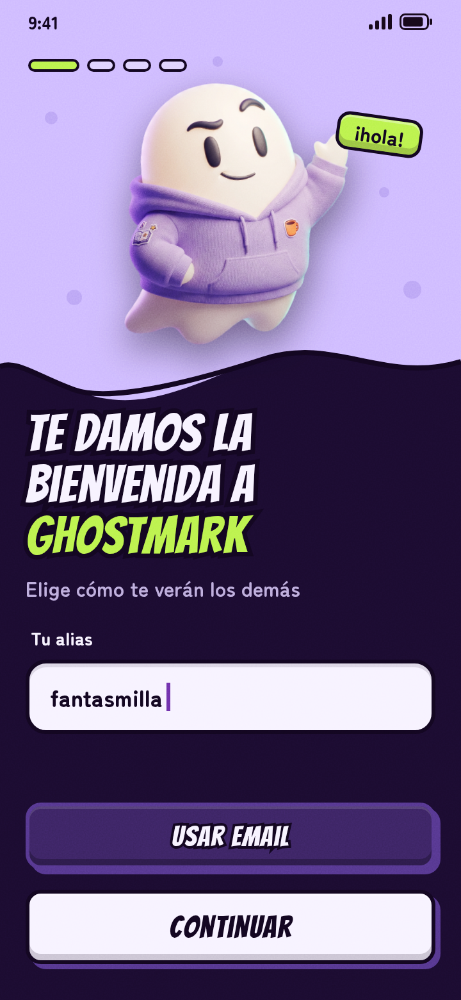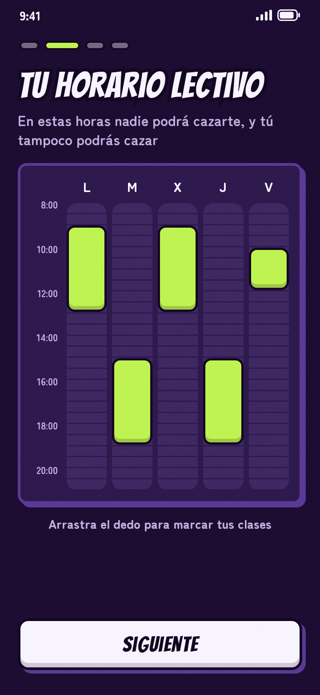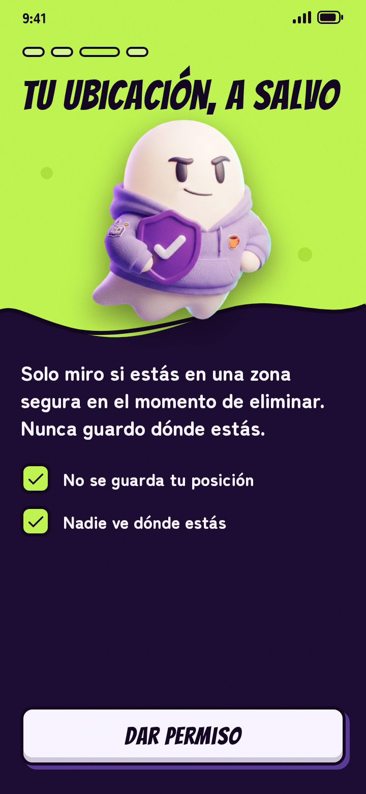

### 2. Crear y configurar una partida · talla M · sprint 1

El máster define la partida y la comparte, y a partir de ahí los demás se inscriben. Puede jugar o solo arbitrar: si juega, la aplicación le oculta todo lo que no le corresponde como jugador. Los pasos 3 (misiones) y 4 (zonas seguras) del asistente son las funcionalidades 6 y 10. La invitación directa a amigos llega con la 15.

| N.º | Estará cumplido cuando… |
|--|--------------------------------------------------------|
| 1 | el máster pueda crear una partida (nombre, fechas, tipo de misiones, plazo de disputas, entradas tardías, si juega), y se verifique que se guarda con esos valores y que se rechaza un fin anterior al inicio |
| 2 | obtenga un QR y un enlace para compartirla, y se verifique que el enlace abre esa partida |

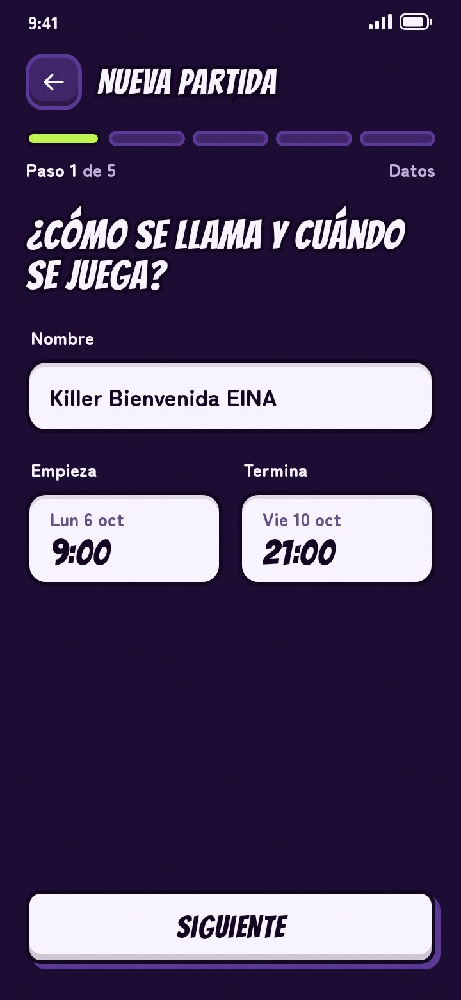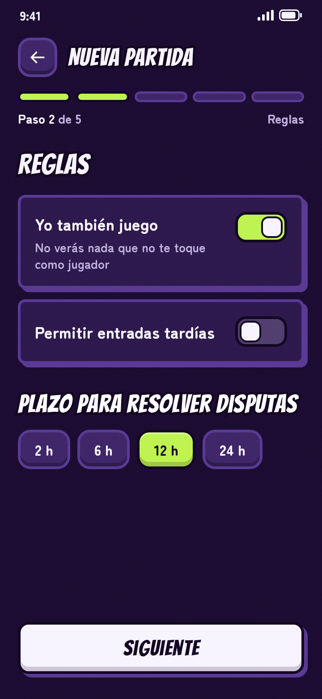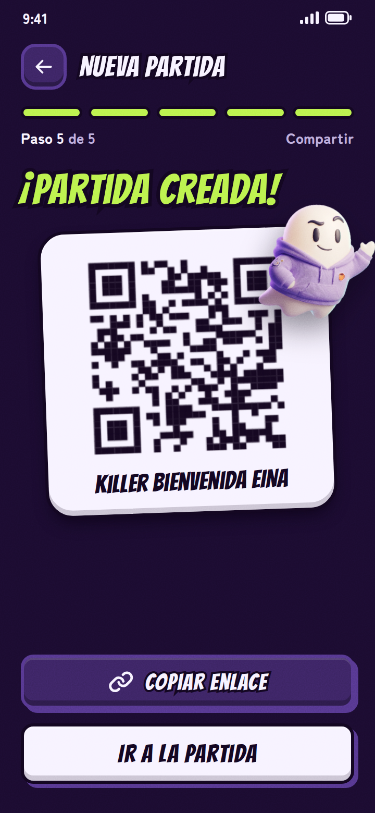

### 3. Inscribirse en una partida · talla M · sprint 1

Un jugador puede estar en varias partidas a la vez, cada una independiente. Al entrar acepta las normas de seguridad de esa partida: misiones sin contacto físico, sin objetos que simulen armas, zonas y horarios seguros, y libertad para abandonar. El máster ve quién se ha apuntado.

| N.º | Estará cumplido cuando… |
|--|--------------------------------------------------------|
| 1 | un jugador pueda entrar por QR o enlace, y se verifique que aparece en la lista de inscritos del máster |
| 2 | acepte las normas de la partida, y se verifique que sin aceptarlas no queda inscrito |
| 3 | pueda revisar su horario lectivo hasta que arranque el juego, y se verifique que después no cambia en esa partida |
| 4 | pueda estar en varias partidas a la vez, y se verifique que cada una es independiente |

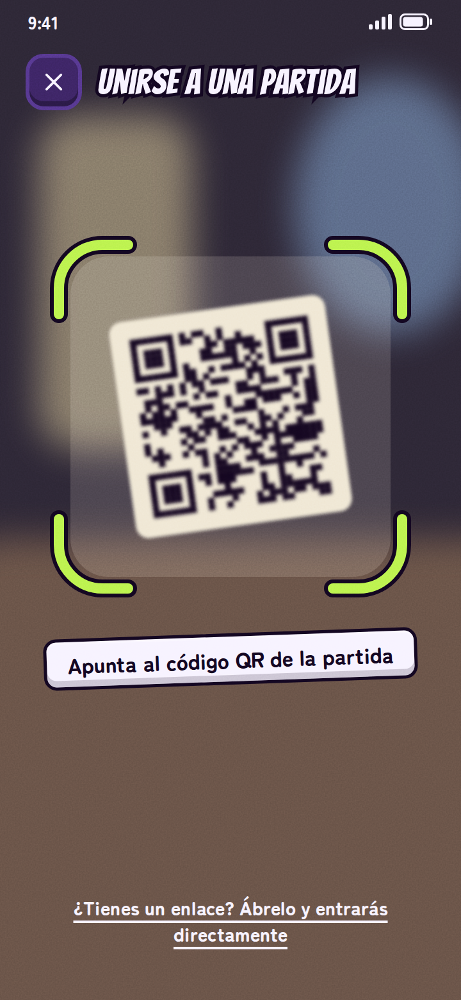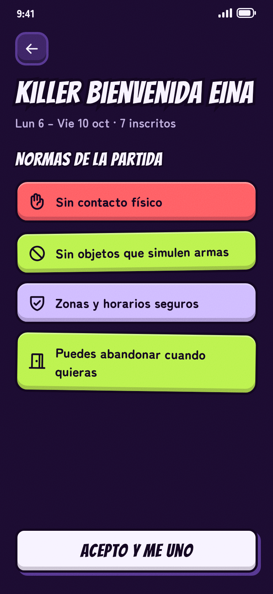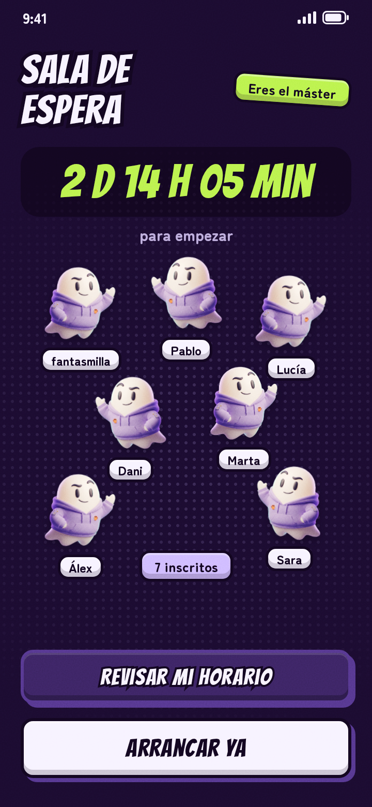

### 4. Arrancar la partida y formar la cadena de objetivos · talla M · sprint 1

La cadena es un único ciclo cerrado: cada jugador persigue a otro y nadie queda fuera. Hacen falta al menos 3 jugadores; si no se llega, la partida se cancela y los inscritos lo ven al abrir la aplicación. El aviso al móvil llega con la 13.

| N.º | Estará cumplido cuando… |
|--|--------------------------------------------------------|
| 1 | la partida arranque sola en la fecha de inicio o antes si el máster la adelanta, y se verifique que pasa a estar en juego |
| 2 | con al menos 3 jugadores se forme un único ciclo cerrado, y se verifique con 3, 4 y 10 jugadores que cada uno tiene un objetivo, es objetivo de otro y no se persigue a sí mismo |
| 3 | con menos de 3 inscritos la partida se cancele, y se verifique que no llega a arrancar |

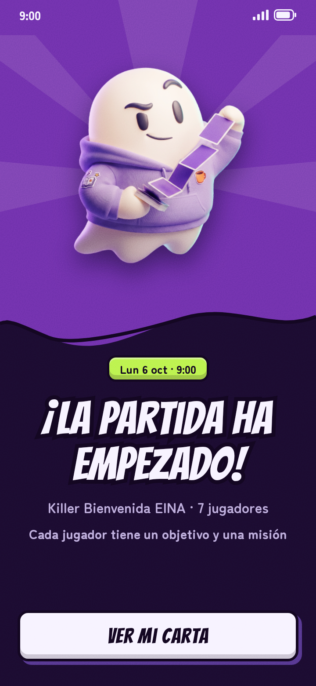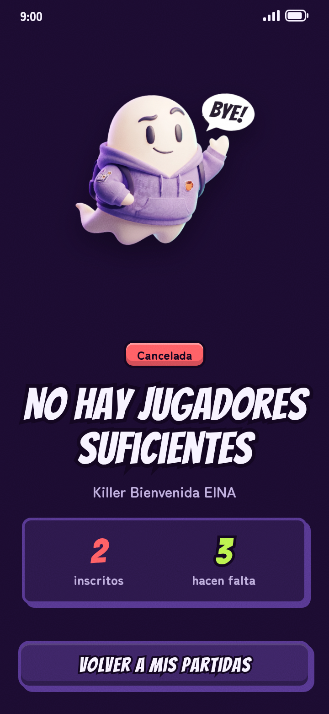

### 5. Ver mi objetivo y mi misión · talla S · sprint 1

Al arrancar, cada jugador recibe un objetivo y una misión en una carta que solo él puede girar. El máster no sabe quién tiene a quién: si juega, solo ve su propio objetivo y su propia misión. Las misiones salen de una biblioteca curada inicial, corta y ya revisada. La 6 la amplía y añade la IA y la aprobación del máster.

| N.º | Estará cumplido cuando… |
|--|--------------------------------------------------------|
| 1 | cada jugador vea solo su objetivo y su misión, y se verifique que nadie ve los ajenos, tampoco el máster si juega |
| 2 | cada jugador reciba al arrancar una misión de la biblioteca curada, y se verifique que ninguna implica contacto físico ni objetos que simulen armas |

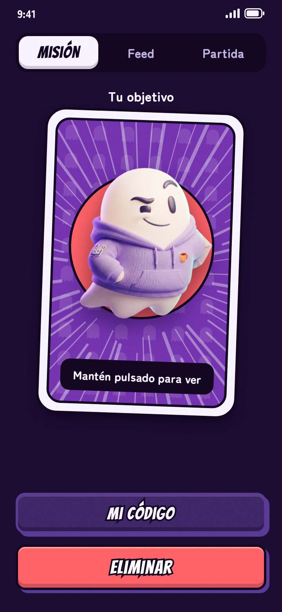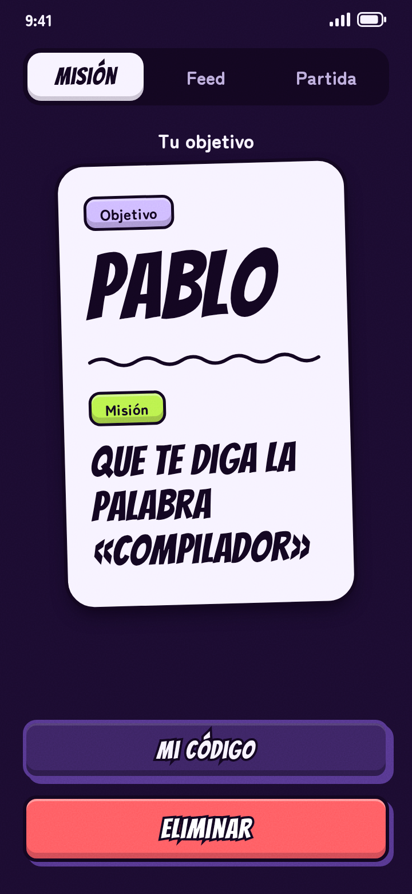

## Resto de la pila

| N.º | Funcionalidad | Estará cumplido cuando… |
|--|-------|--------------------------------------------|
| 6 | Misiones: biblioteca, IA y aprobación del máster | el máster pida misiones a la IA con un contexto y las apruebe o rechace una a una, y se verifique que ninguna entra en juego sin su aprobación |
| 7 | Código de vida y eliminación | el cazador introduzca el código de su víctima, y se verifique que ella queda eliminada y que él hereda su objetivo y su misión |
| 8 | Cierre de partida, ganador y empate | la partida termine por último superviviente, por fecha de fin o por decisión del máster, y se verifique que se declara el ganador o el empate que corresponde |
| 9 | Horarios seguros | un jugador esté en su horario lectivo, y se verifique que no puede eliminar ni ser eliminado |
| 10 | Zonas seguras | el máster dibuje zonas seguras en el mapa, y se verifique que al introducir un código solo se guarda si el cazador estaba dentro o fuera, nunca su posición |
| 11 | Disputas y anulación | la víctima dispute una eliminación en los 10 minutos siguientes, y se verifique que, si se le da la razón, revive y la cadena de objetivos se rehace |
| 12 | Abandonar, expulsar y reportar | un jugador pueda abandonar o reportar y el máster expulsar, y se verifique que, si alguien sale, su cazador hereda su objetivo y su misión |
| 13 | Avisos al móvil | cambie algo en la partida, y se verifique que el aviso llega al momento y solo a quien toca |
| 14 | Ghostmark Wrapped y borrado de datos al cerrar | al cerrar la partida cada jugador vea y pueda compartir su Wrapped, y se verifique que de la partida solo queda el resumen agregado |
| 15 | Amigos e invitaciones directas | un jugador añada amigos por su alias y el máster los invite a una partida, y se verifique que la invitación les llega en la aplicación |
| 16 | Entradas tardías | un jugador entre tarde si el máster lo permite, y se verifique que la cadena sigue cerrada |
| 17 | Importar el horario lectivo desde el calendario | un jugador importe su horario desde un fichero .ics, y se verifique que sus clases aparecen en la rejilla y puede corregirlas |
| 18 | Acceso con Google | un jugador cree su cuenta o inicie sesión con su cuenta de Google, y se verifique que no se le pide contraseña y que la cuenta guarda los mismos datos |
| 19 | Modo por equipos (L2) | se pueda jugar una partida por equipos |
| 20 | Purga final (L2) | una partida con fecha límite pueda terminar con un ganador gracias a una purga final |
| 21 | Partida relámpago (L2) | se pueda jugar una partida corta, pensada para una sola tarde |
| 22 | Co-másters (L2) | varios másters puedan repartirse la gestión de una partida grande |
| 23 | Perfiles de organización (L3) | una organización pueda gestionar sus partidas desde un perfil propio |
| 24 | Plantillas de partida (L3) | una organización pueda reutilizar la configuración de sus partidas |
| 25 | Panel de estadísticas (L3) | una organización pueda consultar estadísticas agregadas de sus partidas |
| 26 | Eventos de varias partidas (L3) | una organización pueda agrupar varias partidas en un mismo evento |
| 27 | Validación reforzada (L3) | las eliminaciones se validen con más garantías frente a las trampas |
| 28 | Premios (L3) | una organización pueda ofrecer premios con reglas definidas de antemano |
